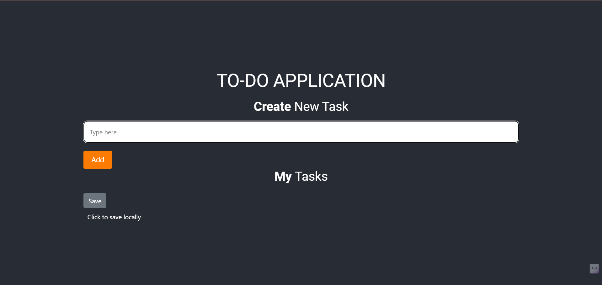
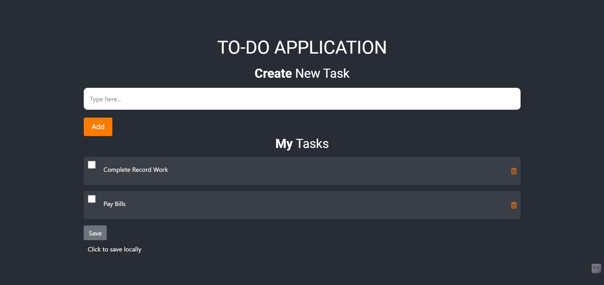
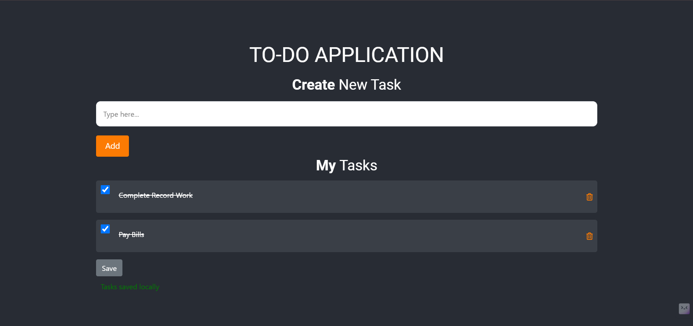

# TO-DO APPLICATION

## Overview

This is a simple and intuitive to-do list application built using HTML, CSS, and JavaScript. The application allows users to create, manage, and save their tasks locally. It's designed to be user-friendly with a modern interface and smooth animations.

## Features

- Add new tasks
- Mark tasks as completed
- Delete tasks
- Save tasks locally to browser storage
- Responsive design

## Demo


*Initial Interface*


*After adding two tasks "Comlete Record Work","Pay Bills"*


*Saving them Locally*


*Marking the two added tasks as done*

## Installation

To run this application locally, follow these steps:

1. **Clone the repository:**
   ```bash
   git clone https://github.com/your-username/todo-application.git
   ```

2. **Navigate to the project directory:**
   ```bash
   cd todo-application
   ```

3. **Open `index.html` in your web browser:**
   You can simply double-click on the `index.html` file, or run a local server using Python:
   ```bash
   python -m http.server
   ```
   Then, open your browser and go to `http://localhost:8000`.

## Usage

1. Add a Task:
   - Enter the task description in the input field.
   - Click the "Add" button to add the task to the list.

2. Mark a Task as Completed:
   - Click the checkbox next to the task description.

3. Delete a Task:
   - Click the trash icon next to the task description to remove it from the list.

4. Save Tasks Locally:
   - Click the "Save" button to save the current list of tasks to local storage. You will see a confirmation message once the tasks are saved.

## File Structure

```
todo-application/
│
├── index.html          # The main HTML file
├── app.css             # The main CSS file
├── app.js              # The main JavaScript file
└── README.md           # This README file
```

## Technologies Used

- HTML
- CSS
- JavaScript
- Bootstrap 4

## Contributing

Contributions are welcome! Please open an issue or submit a pull request for any bugs or improvements.

Developed by [Sai Vikash](https://github.com/saivikash0710)
